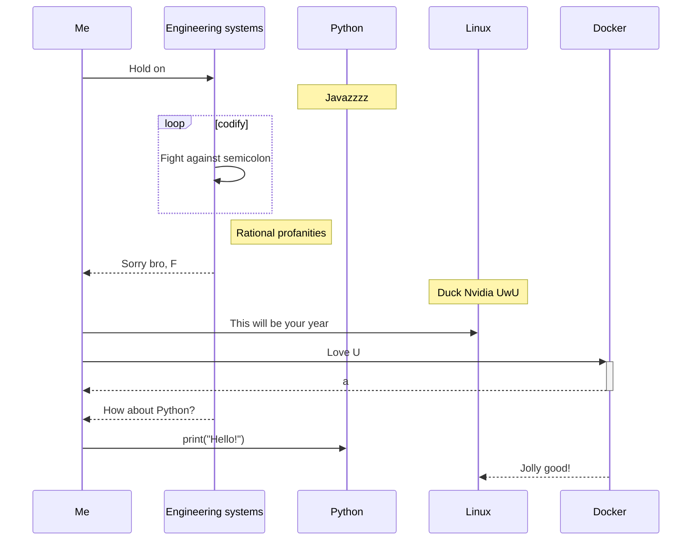

<div align="center">
  <h1>👋 Hi, this is Gatovsky </h1>
</div>

  
  ```text
  💻 Engineering systems student
  🧙🏻‍♂️ Linux user 
  🤓 Otaku who takes a bath 
  🐍 Pythonista
  🐋 Dockerlover
  ```



 
## 🌱 Constantly growing 📈


 


<div align="center"> 
<a href="https://github.com/hharieta/github-readme-stats" title="Most Used Language">

</a>
<a href="https://github.com/hharieta/github-readme-stats">

</a> 
</div>

<!---
hharieta/hharieta is a ✨ special ✨ repository because I said so
--->
